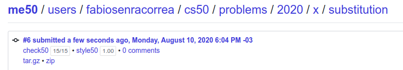

## This is the CS50! Week 2

On this directory, the exercises of Week 2 are covered.

### What was week 2 all about?

Week 2 covers an introduction on data structures, covering how an array is created and manipulated in C, especially when it comes to strings.

Details can be checked [here](https://cs50.harvard.edu/x/2020/weeks/2/).

### What was the exercise here?

On this week, much like last week, there was an exercise having two options, that diverged on difficulty. The student has to choose only one of the options, and it was chosen the harder one. Details [here](https://cs50.harvard.edu/x/2020/psets/2/).

### Exercise 1 - Substitution

Design and implement a program, substitution, that encrypts messages using a substitution cipher.

1. Implement your program in a file called substitution.c in a ~/pset2/substitution directory.
2. Your program must accept a single command-line argument, the key to use for the substitution. The key itself should be case-insensitive, so whether any character in the key is uppercase or lowercase should not affect the behavior of your program.
3. If your program is executed without any command-line arguments or with more than one command-line argument, your program should print an error message of your choice (with printf) and return from main a value of 1 (which tends to signify an error) immediately.
4. If the key is invalid (as by not containing 26 characters, containing any character that is not an alphabetic character, or not containing each letter exactly once), your program should print an error message of your choice (with printf) and return from main a value of 1 immediately.
5. Your program must output plaintext: (without a newline) and then prompt the user for a string of plaintext (using get_string).
6. Your program must output ciphertext: (without a newline) followed by the plaintext’s corresponding ciphertext, with each alphabetical character in the plaintext substituted for the corresponding character in the ciphertext; non-alphabetical characters should be outputted unchanged.
7. Your program must preserve case: capitalized letters must remain capitalized letters; lowercase letters must remain lowercase letters.
8. After outputting ciphertext, you should print a newline. Your program should then exit by returning 0 from main.

#### Grade

**15/15 100%** - as per below:

### Comments

Studying C having JS/Python knowledge is challenging. This exercise would be a cake walk on these languages, but the constraints is C take it to the next level. The puzzling part of the solution was a miss-handle of memory when outputting the crypted text.

The solution first presented here still needs to be refactored, especially when we analyse the size of 'main'. Nonetheless, it handles every possible input and use-case as per described on the instructions.

###### Feedback

As always, any feedback is widely encouraged.