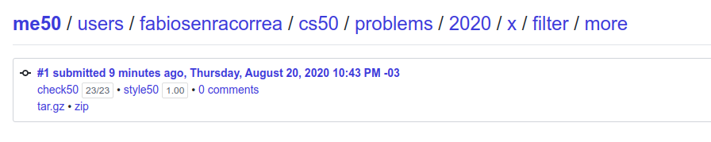
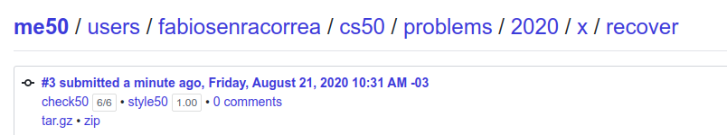

## This is the CS50! Week 4

On this directory, the exercises of Week 4 are covered.

### What was week 4 all about?

It covers hexadecimal notation of memory, how we can build strings using char* and not actually the 'string' type provided in the cs50 library, pointers, how to allocate and free up memory after use, what is a b

* Hexadecimal notation
* Memory Pointers (*) and addresses (&)
* Building strings with char*
* Allocating and freeing up memory with our programs
* Accessing, Appending and Writing on a file
* Basic Image filtering

Details can be checked [here](https://cs50.harvard.edu/x/2020/weeks/4/).

### What was proposed here?

On this week, much like weeks 1 and 3, there was an obligatory exercise and a split, having two options, that diverged on difficulty. The student has to choose only one of the options, and it was chosen the harder one. Details [here](https://cs50.harvard.edu/x/2020/psets/4/).

### Exercise 1 - Filter

This exercise was the 'harder choice' of the week and it covers a creation of 4 algorithms to alter images, applying 'filters' to them:

* Greyscale
* Blur
* Reverse (or mirror)
* Edge

```
The function grayscale should take an image and turn it into a black-and-white version of the same image.

The reflect function should take an image and reflect it horizontally.

The blur function should take an image and turn it into a box-blurred version of the same image.

The edges function should take an image and highlight the edges between objects, according to the Sobel operator.
```
#### Grade

**23/23 100%** - as per below:



### Exercise 2 - Recover

```
Implement your program in a file called recover.c in a directory called recover.

Your program should accept exactly one command-line argument, the name of a forensic image from which to recover JPEGs.

If your program is not executed with exactly one command-line argument, it should remind the user of correct usage, and main should return 1.

If the forensic image cannot be opened for reading, your program should inform the user as much, and main should return 1.

Your program, if it uses malloc, must not leak any memory.
```

#### Grade

**6/6 100%** - as per below:



### Comments

**Filter**: Here the student started to make use of 'check50', a command available to check correctness of the code before actually submitting. That's why it only has one submission recorded, since every correction to the code was done on the same day. The student wanted to 'keep every function as a whole', which is why every function was kept as a huge 1 piece. This code was also use to explain the simple logic behind the problem to other fellow programmers, which is another reasons as to why it's in a single piece.

The problem itself was really nice, requiring good matrix knowledge and awareness.

**Recover**: The goal of this exercise was to recover jpg photos from a raw data file. While the constraints of the project were not very high, understanding how to handle files made this exercise very fun. The general ideia of the solution took some ideas of the pre-written code we had on Filter, but the a-ha! moment was find out i could create a single file pointer and, from there, do the naming, opening, writing and closing logic.


###### Feedback

As always, any feedback is widely encouraged.