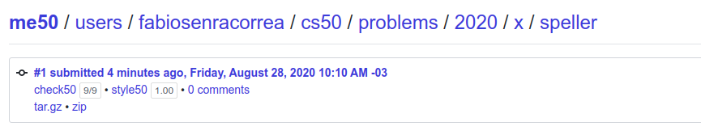

## This is the CS50! Week 5

On this directory, the exercises of Week 5 are covered.

### What was week 5 all about?

Following last week's notion on **memory**, this week covers some of the most important data structures we can build in C, such as:

* Linked Lists
* Hash Tables
* Trees
* Tries

### What was proposed here?

On this week, the exercise proposed is a creation of a dictionary using a **hashtable** that can be used to spell-check different types of texts. The program was also supposed to run *fast*. Check it out [here](https://cs50.harvard.edu/x/2020/psets/5/speller/#:~:text=submit50%20cs50/problems/2020/x/speller)

### Exercise 1 - Speller

Alright, the challenge now before you is to implement, in order, load, hash, size, check, and unload as efficiently as possible using a hash table in such a way that TIME IN load, TIME IN check, TIME IN size, and TIME IN unload are all minimized. To be sure, it’s not obvious what it even means to be minimized, inasmuch as these benchmarks will certainly vary as you feed speller different values for dictionary and for text. But therein lies the challenge, if not the fun, of this problem. This problem is your chance to design. Although we invite you to minimize space, your ultimate enemy is time. But before you dive in, some specifications from us.

You may not alter speller.c or Makefile.

You may alter dictionary.c (and, in fact, must in order to complete the implementations of load, hash, size, check, and unload), but you may not alter the declarations (i.e., prototypes) of load, hash, size, check, or unload. You may, though, add new functions and (local or global) variables to dictionary.c.

You may change the value of N in dictionary.c, so that your hash table can have more buckets.

You may alter dictionary.h, but you may not alter the declarations of load, hash, size, check, or unload.

Your implementation of check must be case-insensitive. In other words, if foo is in dictionary, then check should return true given any capitalization thereof; none of foo, foO, fOo, fOO, fOO, Foo, FoO, FOo, and FOO should be considered misspelled.

Capitalization aside, your implementation of check should only return true for words actually in dictionary. Beware hard-coding common words (e.g., the), lest we pass your implementation a dictionary without those same words. Moreover, the only possessives allowed are those actually in dictionary. In other words, even if foo is in dictionary, check should return false given foo's if foo's is not also in dictionary.

You may assume that any dictionary passed to your program will be structured exactly like ours, alphabetically sorted from top to bottom with one word per line, each of which ends with \n. You may also assume that dictionary will contain at least one word, that no word will be longer than LENGTH (a constant defined in dictionary.h) characters, that no word will appear more than once, that each word will contain only lowercase alphabetical characters and possibly apostrophes, and that no word will start with an apostrophe.

You may assume that check will only be passed words that contain (uppercase or lowercase) alphabetical characters and possibly apostrophes.

Your spell checker may only take text and, optionally, dictionary as input. Although you might be inclined (particularly if among those more comfortable) to “pre-process” our default dictionary in order to derive an “ideal hash function” for it, you may not save the output of any such pre-processing to disk in order to load it back into memory on subsequent runs of your spell checker in order to gain an advantage.

Your spell checker must not leak any memory. Be sure to check for leaks with valgrind.

You may search for (good) hash functions online, so long as you cite the origin of any hash function you integrate into your own code.

Alright, ready to go?

Implement load.
Implement hash.
Implement size.
Implement check.
Implement unload.

#### Grade

**9/9 100%** - as per below:

### Comments

Understanding the basic data structures is crucial in the modern world. The student had it's first direct contact with most of these new structures during this module and it was really fun creating and coding the logic behind a good hash table. The hash function used was the famous dbj2 (credit given inside dictionary.c) and the size of the table was chosen in the light of the challenge: make the program fast.

And, as almost everything in Computer Science, there was a tradeoff: a lot of memory used. More specifically, the HEAD was composed with 10k pointers. In the 'real world', this decision is not as arbitrary as this, in a sense we need to understand what we 'trade' in order to achieve a specific performance grade.

Nonetheless, this project served really well in introducing these concepts to me, and now we are ready to start a high level language: Python.

###### Feedback

As always, any feedback is widely encouraged.