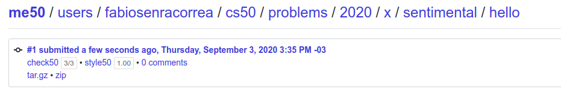
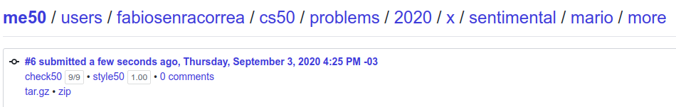
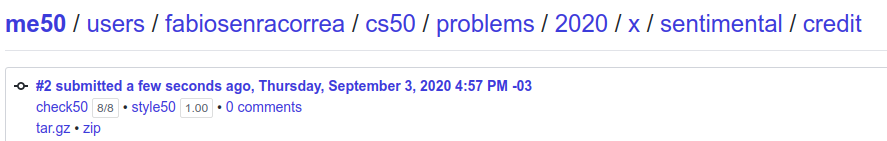
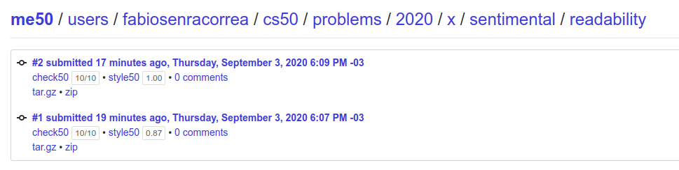
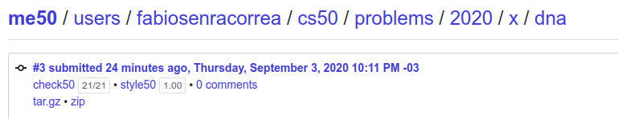

## This is the CS50! Week 6

On this directory, the exercises of Week 6 are covered.

### What was week 6 all about?

After understanding the basics of a low level language (C), it's time to move to a more 'powerful' base language: Python.

But as everything in Computer Science, this 'power' does not come for free. We actually are trading computational time in order to get fancy new features and syntax. Whether this is worth it or not, it depends on the purpose of our code.

### What was proposed here?

As this week is a introduction to a new language, most of the exercises here are re-runs of previously solved challenges, now using Python. You can check the list of problems for this week right [here](https://cs50.harvard.edu/x/2020/psets/6/).

Some of the exercises has a 'choose one out of two' option, and the harder version was chosen every time.

### Exercise 1 - Hello

Implement a program that prints out a simple greeting to the user, per the below.

```
$ python hello.py
What is your name?
David
hello, David
```

#### Grade

**3/3 100%** - as per below:



### Exercise 2 - Mario

Implement a program that prints out a double half-pyramid of a specified height, per the below. (Should reject any num numeric, non positive or bigger than 8 value)

```
$ ./mario
Height: 4
   #  #
  ##  ##
 ###  ###
####  ####
```

#### Grade

**9/9 100%** - as per below:



### Exercise 3 - Credit

Implement a program that determines whether a provided credit card number is valid according to Luhn’s algorithm.

```
$ python credit.py
Number: 378282246310005
AMEX
```

#### Grade

**8/8 100%** - as per below:



### Exercise 4 - Readability

Implement a program that computes the approximate grade level needed to comprehend some text, per the below.

```
$ python readability.py
Text: Congratulations! Today is your day. You're off to Great Places! You're off and away!
Grade 3
```

#### Grade

** 10/10 100%** - as per below:



### Exercise 5 - DNA

> This is the only 'unique' problem for this week. To check it out, go [here](https://cs50.harvard.edu/x/2020/psets/6/dna/)

Implement a program that identifies a person based on their DNA, per the below.

```
$ python dna.py databases/large.csv sequences/5.txt
Lavender
```

In a file called dna.py in ~/pset6/dna/, implement a program that identifies to whom a sequence of DNA belongs.

The program should require as its first command-line argument the name of a CSV file containing the STR counts for a list of individuals and should require as its second command-line argument the name of a text file containing the DNA sequence to identify.

If your program is executed with the incorrect number of command-line arguments, your program should print an error message of your choice (with print). If the correct number of arguments are provided, you may assume that the first argument is indeed the filename of a valid CSV file, and that the second argument is the filename of a valid text file.

Your program should open the CSV file and read its contents into memory.

You may assume that the first row of the CSV file will be the column names. The first column will be the word name and the remaining columns will be the STR sequences themselves.

Your program should open the DNA sequence and read its contents into memory.

For each of the STRs (from the first line of the CSV file), your program should compute the longest run of consecutive repeats of the STR in the
DNA sequence to identify.

If the STR counts match exactly with any of the individuals in the CSV file, your program should print out the name of the matching individual.

You may assume that the STR counts will not match more than one individual.

If the STR counts do not match exactly with any of the individuals in the CSV file, your program should print "No match".

#### Grade

** 21/21 100%** - as per below:




### Comments

Switching yo a high level language is awesome. It frees us from a lot of syntax constraints and enable A LOT more of useful features from the get-go. The hardest part of this problem set was figuring out how to efficiently use python's **regex** lib, especially since the use here is different than Javascript's more user-friendly approach.

It feels like having built a lot of programs in C helped me to improve my overall logic for algorithms, since most programs were completed with a few tries only, and most of them was just me trying to adhere 100% to the new *style* features of the new language.

###### Feedback

As always, any feedback is widely encouraged.