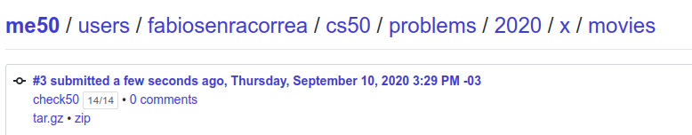
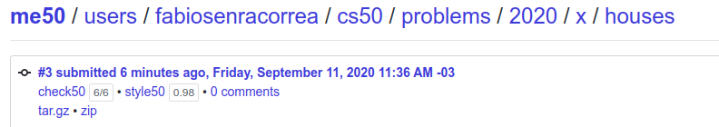

## This is the CS50! Week 7

On this directory, the exercises of Week 7 are covered.

### What was week 7 all about?

After learning more about a higher level language, Python, and poking around data bases dealing with CSV files with python scripts, like [week 6 dna's problem](../Week_6_Python/dna).

And to deal with large data sets, in the real world, it's probable that we are going to come across a SQL database. The basics of which were introduced:

* Queries with SELECT/FROM/WHERE/GROUP BY/ORDER BY/HAVING
* Creation of tables using CREATE TABLE
* Use of PRIMARY/FOREIGN KEYS
* Creation and concept of an INDEX
* Data types
* Use of a Query Builder to escape possible bad injections

For this lesson, SQLITE3 is used.

### What was proposed here?

Following this huge SQL introduction, two exercises are proposed. You can check them out [here](https://cs50.harvard.edu/x/2020/psets/7/).

### Exercise 1 - Movies

In 1.sql, write a SQL query to list the titles of all movies released in 2008.

  Your query should output a table with a single column for the title of each movie.

In 2.sql, write a SQL query to determine the birth year of Emma Stone.

  Your query should output a table with a single column and a single row (plus optional header) containing Emma Stone’s birth year.

  You may assume that there is only one person in the database with the name Emma Stone.

In 3.sql, write a SQL query to list the titles of all movies with a release date on or after 2018, in alphabetical order.

  Your query should output a table with a single column for the title of each movie.

  Movies released in 2018 should be included, as should movies with release dates in the future.

In 4.sql, write a SQL query to determine the number of movies with an IMDb rating of 10.0.

  Your query should output a table with a single column and a single row (plus optional header) containing the number of movies with a 10.0 rating.

In 5.sql, write a SQL query to list the titles and release years of all Harry Potter movies, in chronological order.

  Your query should output a table with two columns, one for the title of each movie and one for the release year of each movie.

  You may assume that the title of all Harry Potter movies will begin with the words “Harry Potter”, and that if a movie title begins with the words “Harry Potter”, it is a Harry Potter movie.

In 6.sql, write a SQL query to determine the average rating of all movies released in 2012.

  Your query should output a table with a single column and a single row (plus optional header) containing the average rating.

In 7.sql, write a SQL query to list all movies released in 2010 and their ratings, in descending order by rating. For movies with the same rating, order them alphabetically by title.

  Your query should output a table with two columns, one for the title of each movie and one for the rating of each movie.

  Movies that do not have ratings should not be included in the result.

In 8.sql, write a SQL query to list the names of all people who starred in Toy Story.

  Your query should output a table with a single column for the name of each person.

  You may assume that there is only one movie in the database with the title Toy Story.

In 9.sql, write a SQL query to list the names of all people who starred in a movie released in 2004, ordered by birth year.

  Your query should output a table with a single column for the name of each person.

  People with the same birth year may be listed in any order.

  No need to worry about people who have no birth year listed, so long as those who do have a birth year are listed in order.

  If a person appeared in more than one movie in 2004, they should only appear in your results once.

In 10.sql, write a SQL query to list the names of all people who have directed a movie that received a rating of at least 9.0.

  Your query should output a table with a single column for the name of each person.

In 11.sql, write a SQL query to list the titles of the five highest rated movies (in order) that Chadwick Boseman starred in, starting with the highest rated.

  Your query should output a table with a single column for the title of each movie.

  You may assume that there is only one person in the database with the name Chadwick Boseman.

In 12.sql, write a SQL query to list the titles of all movies in which both Johnny Depp and Helena Bonham Carter starred.

  Your query should output a table with a single column for the title of each movie.

  You may assume that there is only one person in the database with the name Johnny Depp.

  You may assume that there is only one person in the database with the name Helena Bonham Carter.

In 13.sql, write a SQL query to list the names of all people who starred in a movie in which Kevin Bacon also starred.

  Your query should output a table with a single column for the name of each person.

  There may be multiple people named Kevin Bacon in the database. Be sure to only select the Kevin Bacon born in 1958.

  Kevin Bacon himself should not be included in the resulting list.

#### Grade

**14/14 100%** - as per below:

### Exercise 2 -Houses

Hogwarts is in need of a student database. For years, the professors have been maintaining a CSV file containing all of the students’ names and houses and years. But that file didn’t make it particularly easy to get access to certain data, such as a roster of all the Ravenclaw students, or an alphabetical listing of the students enrolled at the school.

The challenge ahead of you is to import all of the school’s data into a SQLite database, and write a Python program to query that database to get house rosters for each of the houses of Hogwarts.

Specification

In import.py, write a program that imports data from a CSV spreadsheet.

  Your program should accept the name of a CSV file as a command-line argument.

    If the incorrect number of command-line arguments are provided, your program should print an error and exit.

    You may assume that the CSV file will exist, and will have columns name, house, and birth.

    For each student in the CSV file, insert the student into the students table in the students.db database.

    While the CSV file provided to you has just a name column, the database has separate columns for first, middle, and last names. You’ll thus want to first parse each name and separate it into first, middle, and last names. You may assume that each person’s name field will contain either two space-separated names (a first and last name) or three space-separated names (a first, middle, and last name). For students without a middle name, you should leave their middle name field as NULL in the table.

In roster.py, write a program that prints a list of students for a given house in alphabetical order.

  Your program should accept the name of a house as a command-line argument.

    If the incorrect number of command-line arguments are provided, your program should print an error and exit.

  Your program should query the students table in the students.db database for all of the students in the specified house.

  Your program should then print out each student’s full name and birth year (formatted as, e.g., Harry James Potter, born 1980 or Luna Lovegood, born 1981).

    Each student should be printed on their own line.

    Students should be ordered by last name. For students with the same last name, they should be ordered by first name.

#### Grade

**6/6 100%** - as per below:

### Comments

SQL is a really powerful tool for any developer. Understanding how to join tables and extract the exact data needed, using 1 OR MORE distinct queries should be a desirable skill. On this problem set, building the queries to get the data was easy up until there were more complex conditions to account for. On these cases, a higher abstraction power is required.

###### Feedback

As always, any feedback is widely encouraged.