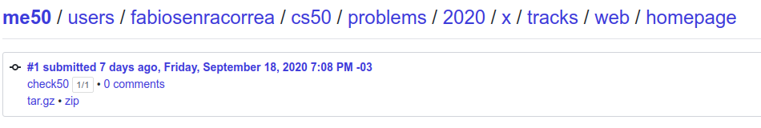
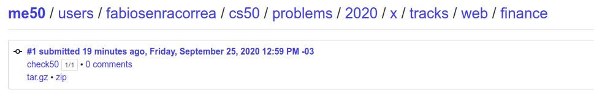

## This is the CS50! Week 8

On this directory, the exercises of Week 8 are covered.

### What was week 8 all about?

In order to wrap up all the weeks, each student has to choose a track to then develop projects on the chosen path. You can check the instructions [here](https://cs50.harvard.edu/x/2020/weeks/8/).

The options available are:

* Web
* Mobile (Android OR iOS)
* Games

Each having their specific frameworks/languages and problem set. To be on par with my overall career goal, i've chosen the **Web** track. Details below.

#### Web Track

Following the path chosen, the Web track presents itself in modules, covering the basics of the suggested Stack:

* HTTP
* HTML
* CSS
* Javascript
* Flask
* Databases

It's important to mention the course's design pattern for web applications: **MVC** (Model View Controller), in which there's a back-end (**C**) that serves the requested pages (**V**), interacting to **CRUD** (**C**reate **R**ead **U**pdate **D**elete) into the database (**M**).

### What was proposed here?

After understanding the proposed Stack, 2 projects were supposed to be submitted: [Homepage](https://cs50.harvard.edu/x/2020/tracks/web/homepage/) and [Finance](https://cs50.harvard.edu/x/2020/tracks/web/finance/).

### Exercise 1 - Homepage

* Contain at least four different .html pages, at least one of which is index.html (the main page of your website), and it should be possible to get from any page on your website to any other page by following one or more hyperlinks.

* Use at least ten (10) distinct HTML tags besides <html>, <head>, <body>, and <title>. Using some tag (e.g., 
) multiple times still counts as just one (1) of those ten!

* Integrate one or more features from Bootstrap into your site. Bootstrap is a popular library (that comes with lots of CSS classes and more) via which you can beautify your site. See Bootstrap’s documentation to get started. To add Bootstrap to your site, it suffices to include

* Have at least one stylesheet file of your own creation, styles.css, which uses at least five (5) different CSS selectors (e.g. tag (example), class (.example), or ID (#example)), and within which you use a total of at least five (5) different CSS properties, such as font-size, or margin; and

* Integrate one or more features of JavaScript into your site to make your site more interactive. For example, you can use JavaScript to add alerts, to have an effect at a recurring interval, or to add interactivity to buttons, dropdowns, or forms. Feel free to be creative!

* Ensure that your site looks nice on browsers both on mobile devices as well as laptops and desktops.

#### Grade

**1/1 100%** - as per below:

### Exercise 2 - Finance

- `register`

Complete the implementation of register in such a way that it allows a user to register for an account via a form.

Require that a user input a username, implemented as a text field whose name is username.

Render an apology if the user’s input is blank or the username already exists.

Require that a user input a password, implemented as a text field whose name is password, and then that same password again, implemented as a text field whose name is confirmation. Render an apology if either input is blank or the passwords do not match.

Submit the user’s input via POST to /register.
INSERT the new user into users, storing a hash of the user’s password, not the password itself. Hash the user’s password with generate_password_hash Odds are you’ll want to create a new template (e.g., register.html) that’s quite similar to login.html.

Once you’ve implemented register correctly, you should be able to register for an account and log in (since login and logout already work)! And you should be able to see your rows via phpLiteAdmin or sqlite3.

- `quote`

Complete the implementation of quote in such a way that it allows a user to look up a stock’s current price.

Require that a user input a stock’s symbol, implemented as a text field whose name is symbol.

Submit the user’s input via POST to /quote.

Odds are you’ll want to create two new templates (e.g., quote.html and quoted.html). When a user visits /quote via GET, render one of those templates, inside of which should be an HTML form that submits to /quote via POST. In response to a POST, quote can render that second template, embedding within it one or more values from lookup.

- `buy`

Complete the implementation of buy in such a way that it enables a user to buy stocks.

Require that a user input a stock’s symbol, implemented as a text field whose name is symbol. Render an apology if the input is blank or the symbol does not exist (as per the return value of lookup).

Require that a user input a number of shares, implemented as a text field whose name is shares. Render an apology if the input is not a positive integer.

Submit the user’s input via POST to /buy.

Odds are you’ll want to call lookup to look up a stock’s current price.

Odds are you’ll want to SELECT how much cash the user currently has in users.

Add one or more new tables to finance.db via which to keep track of the purchase. Store enough information so that you know who bought what at what price and when.

Use appropriate SQLite types.

Define UNIQUE indexes on any fields that should be unique.

Define (non-UNIQUE) indexes on any fields via which you will search (as via SELECT with WHERE).

Render an apology, without completing a purchase, if the user cannot afford the number of shares at the current price.

You don’t need to worry about race conditions (or use transactions).

Once you’ve implemented buy correctly, you should be able to see users’ purchases in your new table(s) via phpLiteAdmin or sqlite3.

- `index`

Complete the implementation of index in such a way that it displays an HTML table summarizing, for the user currently logged in, which stocks the user owns, the numbers of shares owned, the current price of each stock, and the total value of each holding (i.e., shares times price). Also display the user’s current cash balance along with a grand total (i.e., stocks’ total value plus cash).

Odds are you’ll want to execute multiple SELECTs. Depending on how you implement your table(s), you might find GROUP BY HAVING SUM and/or WHERE of interest.

Odds are you’ll want to call lookup for each stock.

- `sell`

Complete the implementation of sell in such a way that it enables a user to sell shares of a stock (that he or she owns).

Require that a user input a stock’s symbol, implemented as a select menu whose name is symbol. Render an apology if the user fails to select a stock or if (somehow, once submitted) the user does not own any shares of that stock.
Require that a user input a number of shares, implemented as a text field whose name is shares. Render an apology if the input is not a positive integer or if the user does not own that many shares of the stock.

Submit the user’s input via POST to /sell.

You don’t need to worry about race conditions (or use transactions).

- `history`

Complete the implementation of history in such a way that it displays an HTML table summarizing all of a user’s transactions ever, listing row by row each and every buy and every sell.

For each row, make clear whether a stock was bought or sold and include the stock’s symbol, the (purchase or sale) price, the number of shares bought or sold, and the date and time at which the transaction occurred.

You might need to alter the table you created for buy or supplement it with an additional table. Try to minimize redundancies.

- `personal touch`

Implement at least one personal touch of your choice:

Allow users to change their passwords. [x]

Allow users to add additional cash to their account. [x]

Allow users to buy more shares or sell shares of stocks they already own via index itself, without having to type stocks’ symbols manually.

Require users’ passwords to have some number of letters, numbers, and/or symbols.

#### Grade

**1/1 100%** - as per below:

### Comments

After learning each building block, it's great to finally glue them together to create an application that works as required. As a personal opinion, the best part of this Week was creating `Finance`, as it required a functional back-end with a database!

Designing how the database would be is for sure one of the 'coolest' parts of the whole project, as most of the data we are going to show depend vastly on how organized the data itself is. As such, it was decided to create 3 tables:

1. users: holds crucial user info - ID, username, hashed password and cash available
2. stock_operations: holds the history of every transaction, be it a buy or a sell, linked via user_id with the `users` table.
3. stock_count: holds the current available stocks for each user, also linked via user_id with the `users` table.

If you want to check the projects directory or an overview on a gif, [check it out](./finance)!

###### Feedback

As always, any feedback is widely encouraged.
